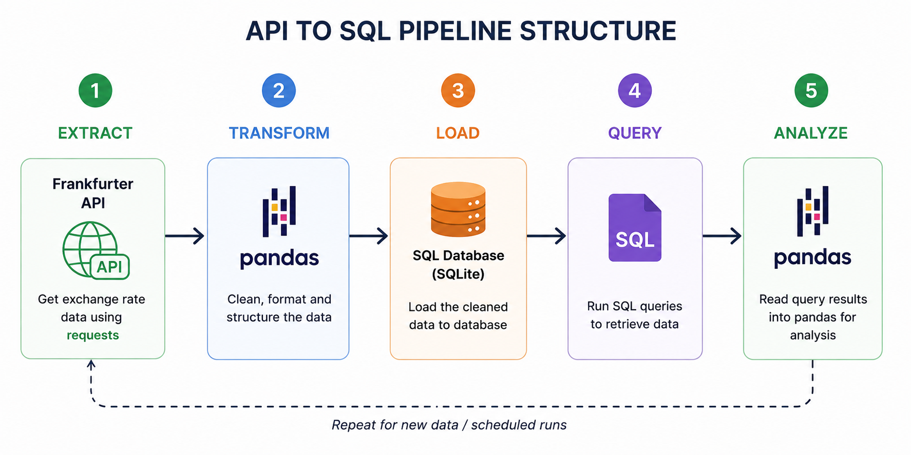

# API to SQL Data Pipeline

An end-to-end Python ETL project that extracts exchange-rate data from the **Frankfurter API**, transforms the data using Pandas, stores it in a SQL database, and retrieves the stored data for analysis.

## Pipeline Overview


## Project Overview

This project demonstrates how data can move through a complete ETL (Extract, Transform, Load) pipeline.

The workflow starts by extracting exchange-rate data from the **Frankfurter API** using the `requests` library. The raw data is then converted into a Pandas DataFrame, cleaned and transformed, and loaded into a SQL database.

Once the data is stored, SQL queries can be used to retrieve specific information. The query results can then be loaded back into Pandas using `pd.read_sql()` for further analysis.

## Pipeline Structure

**Frankfurter API → Requests → Pandas → SQL Database → SQL Query → Pandas → Analysis**

### 1. Extract

Data is retrieved from the Frankfurter API using Python's `requests` library.

```python
import requests

response = requests.get(API_URL)
data = response.json()
```

### 2. Transform

The API response is converted into a Pandas DataFrame and prepared for storage.

```python
import pandas as pd

df = pd.DataFrame(data)
```

The transformation stage can include:

- Cleaning missing values
- Removing duplicates
- Renaming columns
- Converting data types
- Removing unnecessary columns
- Creating calculated columns

### 3. Load

The transformed data is loaded into a SQL database.

```python
from sqlalchemy import create_engine

engine = create_engine("sqlite:///data.db")

df.to_sql(
    "exchange_rates",
    engine,
    if_exists="replace",
    index=False
)
```

### 4. Query

SQL is used to retrieve the required data from the database.

```python
query = """
SELECT *
FROM exchange_rates
"""
```

### 5. Read SQL Data into Pandas

The SQL query can be executed directly from Pandas using `pd.read_sql()`.

```python
result = pd.read_sql(query, engine)
```

This allows SQL to handle data retrieval while Pandas can be used for further analysis and manipulation.

## Example SQL Query

```sql
SELECT *
FROM exchange_rates
ORDER BY date DESC;
```

The result can then be loaded into Pandas:

```python
result = pd.read_sql(query, engine)
```

## Technologies Used

- Python
- Pandas
- Requests
- SQL
- SQLite
- SQLAlchemy
- Jupyter Notebook / VS Code

## Project Structure

```text
api-sql-pipeline/
│
├── data/
│   └── ...
│
├── notebooks/
│   └── pipeline.ipynb
│
├── src/
│   ├── extract.py
│   ├── transform.py
│   └── load.py
│
├── requirements.txt
└── README.md
```

## Installation

Clone the repository and install the required dependencies:

```bash
pip install -r requirements.txt
```

## How to Run

1. Configure the Frankfurter API endpoint.
2. Extract the exchange-rate data using `requests`.
3. Convert the API response into a Pandas DataFrame.
4. Clean and transform the data.
5. Load the transformed data into the SQL database.
6. Write SQL queries to retrieve the required information.
7. Use `pd.read_sql()` to load query results back into Pandas.
8. Perform analysis on the retrieved data.

## Key Learning

The main goal of this project is to understand how different tools work together in a data pipeline.

```text
Frankfurter API
       ↓
    Requests
       ↓
     Pandas
       ↓
 Transform / Clean
       ↓
  SQL Database
       ↓
    SQL Query
       ↓
     Pandas
       ↓
    Analysis
```

This project provides a foundation for building more advanced data engineering pipelines involving automated scheduling, data validation, logging, larger databases, and incremental data loading.

## Future Improvements

- Add automated pipeline scheduling
- Implement data validation
- Add error handling and logging
- Use incremental loading instead of replacing the entire table
- Add database indexes for faster queries
- Export processed data to CSV
- Containerize the pipeline with Docker
- Deploy the pipeline to a cloud environment

## Author

**D_Greatest**
